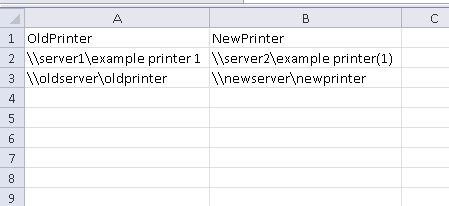
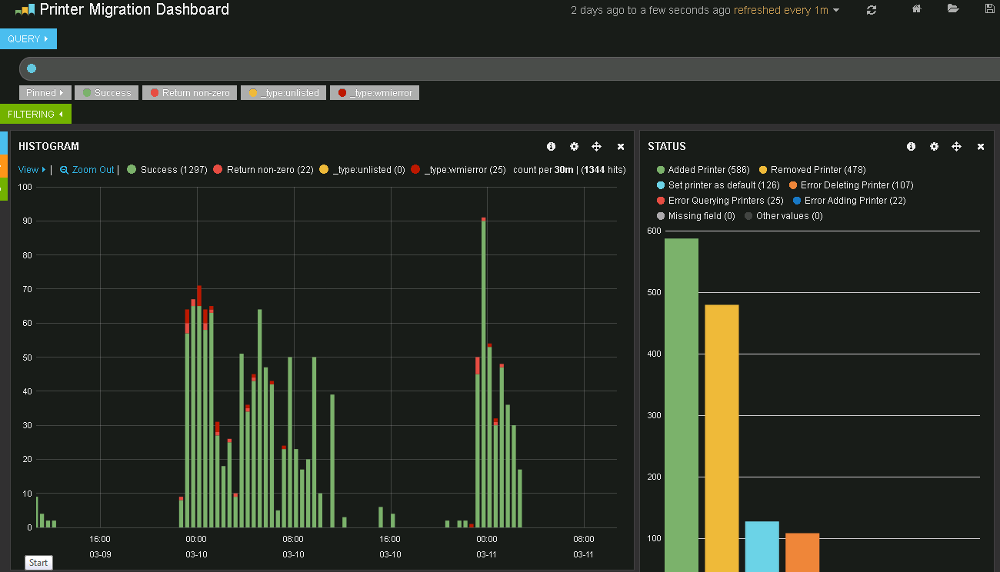
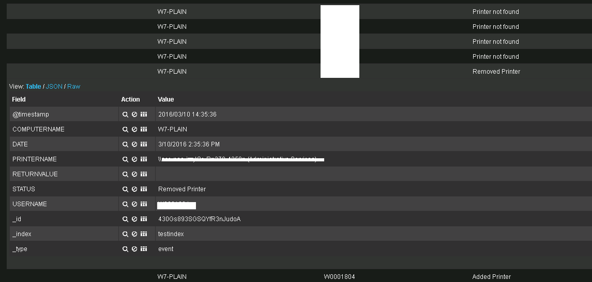

Powershell Printer Migration now with ElasticSearch/Kibana logging
==================================================================

powershell logon script to migrate print mappings from one server to another and logging to ElasticSearch so logs can be searched, filtered, and graphed with Kibana

Introduction
------------
This script is based on http://learn-powershell.net/2012/11/15/use-powershell-logon-script-to-update-printer-mappings/

When preparing to sunset a print server we wanted to migrate the printer mappings using a script by Boe Prox which simply replaces the old server name with the new name, adds the printer and then deletes the old mapping. We ran into a problem however, the old printer queue names were not standardised and so we wanted to rename some of the queues as well as move them to a new server.

Our solution was to use a csv file with a list of old queues and new queues. Each time a user logs in the script will check their printers and if the printer is mapped to an OldPrinter entry in the csv file it will add the corresponding new print queue and then delete the old one.

All events such as adding and removing printers are logged with computer, username, printername etc, as well as any errors.

Prerequisites
-------------
* ElasticSearch/Kibana 

To use the dynamic interface for graphing and searching the logs you must have installed elasticsearch and kibana. Details at https://www.elastic.co/
* Domain 

This project assumes you are using group policy to assign a logon script. Details at https://technet.microsoft.com/en-us/library/cc753404.aspx

Instructions for use
--------------------

* Edit MigratePrinters.ps1 and specify the full path to PrinterQueues.csv. $ElasticSearch should point to an elasticsearch server, including the port and the index you want to save entries to. Add path for $PrinterLog as well.
* Edit PrinterQueues.csv and add a line for each old printer queue and corresponding new printer queue.
* Copy the MigratePrinters.ps1 and PrinterQueues.csv to a unc folder such as \\domain\netlogon
* Create a group policy object and specify MigratePrinters.ps1 path under logon scripts on the powershell tab. It is important to use the powershell tab.
* Create the log files and write the first line (headers)
* Go to your kibana interface and add a dashboard pointing to the index you specified in the first step.